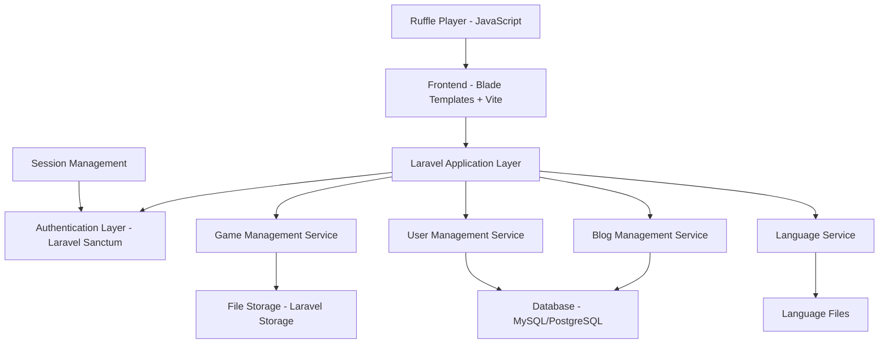
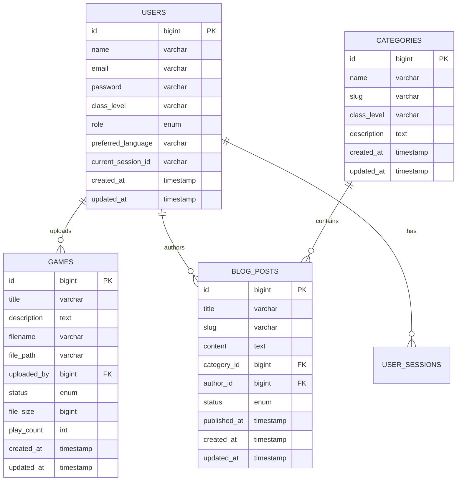

# Design Document

## Overview

The Flash Game Website is a Laravel-based web application that provides a platform for students to play Flash games using Ruffle Player, read educational blog content, and interact with a child-friendly gaming interface. The system includes comprehensive admin controls, multi-language support, and secure single-session authentication.

## Architecture

### High-Level Architecture



### Technology Stack

- **Backend Framework**: Laravel 10.x (PHP 8.1+)
- **Frontend**: Blade templates with Vite for asset compilation
- **Database**: MySQL/PostgreSQL with Laravel Eloquent ORM
- **Authentication**: Laravel Sanctum for session management
- **File Storage**: Laravel Storage with local/cloud storage support
- **Flash Player**: Ruffle Player (WebAssembly-based Flash emulator)
- **Internationalization**: Laravel's built-in localization
- **Styling**: Tailwind CSS for responsive, child-friendly UI

## Components and Interfaces

### 1. Authentication System

**Components:**
- `AuthController`: Handles login, logout, registration
- `SessionManager`: Manages single-session enforcement
- `UserMiddleware`: Validates authentication state

**Key Features:**
- Single-session enforcement using database session tracking
- Session hijacking prevention with IP and user-agent validation
- Automatic session cleanup for expired/duplicate sessions

### 2. Game Management System

**Components:**
- `GameController`: Handles game CRUD operations
- `GameUploadService`: Manages .swf file uploads and validation
- `RufflePlayerService`: Integrates Ruffle Player functionality

**File Structure:**
```
storage/
├── app/
│   └── games/
│       ├── swf/          # Original .swf files
│       └── thumbnails/   # Game thumbnails
```

**Game Model Schema:**
```php
class Game extends Model {
    protected $fillable = [
        'title', 'description', 'filename', 'file_path', 
        'thumbnail_path', 'uploaded_by', 'status', 'file_size'
    ];
}
```

### 3. Blog Management System

**Components:**
- `BlogController`: Handles blog post CRUD
- `CategoryController`: Manages class-level categories
- `BlogService`: Business logic for content management

**Database Schema:**
```php
// Categories table
class Category extends Model {
    protected $fillable = ['name', 'slug', 'class_level', 'description'];
}

// Blog posts table
class BlogPost extends Model {
    protected $fillable = [
        'title', 'slug', 'content', 'excerpt', 'category_id', 
        'author_id', 'status', 'published_at'
    ];
}
```

### 4. User Management System

**Components:**
- `UserController`: Admin user management
- `StudentController`: Student-specific operations
- `UserService`: User business logic

**User Model Extensions:**
```php
class User extends Authenticatable {
    protected $fillable = [
        'name', 'email', 'password', 'class_level', 
        'role', 'last_login_at', 'current_session_id'
    ];
}
```

### 5. Multi-Language System

**Components:**
- `LanguageController`: Language switching
- `LocalizationMiddleware`: Sets application locale
- Language files in `resources/lang/`

**Supported Languages:**
- English (en)
- Myanmar (my)

### 6. Admin Panel

**Components:**
- `AdminController`: Main admin dashboard
- `AdminGameController`: Game moderation
- `AdminBlogController`: Blog management
- `AdminUserController`: User administration

## Data Models

### Core Models

```php
// User Model
class User extends Authenticatable {
    protected $fillable = [
        'name', 'email', 'password', 'class_level', 'role',
        'last_login_at', 'current_session_id', 'preferred_language'
    ];
    
    public function games() {
        return $this->hasMany(Game::class, 'uploaded_by');
    }
    
    public function blogPosts() {
        return $this->hasMany(BlogPost::class, 'author_id');
    }
}

// Game Model
class Game extends Model {
    protected $fillable = [
        'title', 'description', 'filename', 'file_path',
        'thumbnail_path', 'uploaded_by', 'status', 'file_size',
        'play_count', 'approved_at'
    ];
    
    public function uploader() {
        return $this->belongsTo(User::class, 'uploaded_by');
    }
}

// BlogPost Model
class BlogPost extends Model {
    protected $fillable = [
        'title', 'slug', 'content', 'excerpt', 'category_id',
        'author_id', 'status', 'published_at', 'featured_image'
    ];
    
    public function category() {
        return $this->belongsTo(Category::class);
    }
    
    public function author() {
        return $this->belongsTo(User::class, 'author_id');
    }
}

// Category Model
class Category extends Model {
    protected $fillable = [
        'name', 'slug', 'class_level', 'description', 'color'
    ];
    
    public function blogPosts() {
        return $this->hasMany(BlogPost::class);
    }
}

// UserSession Model (for single-session tracking)
class UserSession extends Model {
    protected $fillable = [
        'user_id', 'session_id', 'ip_address', 'user_agent',
        'last_activity', 'is_active'
    ];
}
```

### Database Relationships



## Error Handling

### Application-Level Error Handling

1. **File Upload Errors**
   - Invalid file types: Display user-friendly message
   - File size limits: Show maximum allowed size
   - Storage failures: Log error and show generic message

2. **Authentication Errors**
   - Invalid credentials: Clear error message
   - Session conflicts: Specific messaging about device conflicts
   - Expired sessions: Automatic redirect to login

3. **Game Loading Errors**
   - Corrupted .swf files: Fallback error display
   - Ruffle Player failures: Alternative loading methods
   - Network issues: Retry mechanisms

4. **Database Errors**
   - Connection failures: Graceful degradation
   - Constraint violations: User-friendly validation messages
   - Migration issues: Proper rollback procedures

### Child-Friendly Error Messages

```php
// Error message examples
$errorMessages = [
    'game_not_found' => 'Oops! This game is playing hide and seek. Try another one!',
    'upload_failed' => 'Your game file is being shy. Please try uploading again!',
    'login_required' => 'You need to sign in first to play games!',
    'session_conflict' => 'Looks like you\'re logged in somewhere else. Please log out there first!'
];
```

## Testing Strategy

### Unit Testing

1. **Model Tests**
   - User authentication and session management
   - Game file validation and storage
   - Blog post CRUD operations
   - Category management

2. **Service Tests**
   - File upload service
   - Session management service
   - Language switching service
   - Game approval workflow

### Integration Testing

1. **Authentication Flow**
   - Registration process
   - Login/logout functionality
   - Single-session enforcement
   - Session timeout handling

2. **Game Management**
   - File upload and validation
   - Game approval process
   - Ruffle Player integration
   - Game deletion and cleanup

3. **Blog System**
   - Post creation and editing
   - Category assignment
   - Content filtering by class level
   - Multi-language content display

### Feature Testing

1. **User Workflows**
   - Student registration and game playing
   - Admin content management
   - Language switching
   - Mobile responsiveness

2. **Security Testing**
   - Session hijacking prevention
   - File upload security
   - XSS and CSRF protection
   - Input validation

### Frontend Testing

1. **Ruffle Player Integration**
   - .swf file loading
   - Game controls functionality
   - Error handling for unsupported games
   - Performance optimization

2. **UI/UX Testing**
   - Child-friendly interface validation
   - Responsive design testing
   - Accessibility compliance
   - Cross-browser compatibility

### Performance Testing

1. **File Upload Performance**
   - Large .swf file handling
   - Concurrent upload testing
   - Storage optimization

2. **Game Loading Performance**
   - Ruffle Player initialization
   - Memory usage optimization
   - Network bandwidth considerations

## Security Considerations

### Authentication Security
- Password hashing using Laravel's bcrypt
- CSRF protection on all forms
- Rate limiting on login attempts
- Secure session management

### File Upload Security
- File type validation (only .swf files)
- File size limitations
- Virus scanning integration
- Secure file storage outside web root

### Session Security
- Secure session cookies
- Session regeneration on login
- IP address validation
- User agent verification

### Data Protection
- Input sanitization and validation
- SQL injection prevention via Eloquent ORM
- XSS protection in Blade templates
- Secure file serving for games